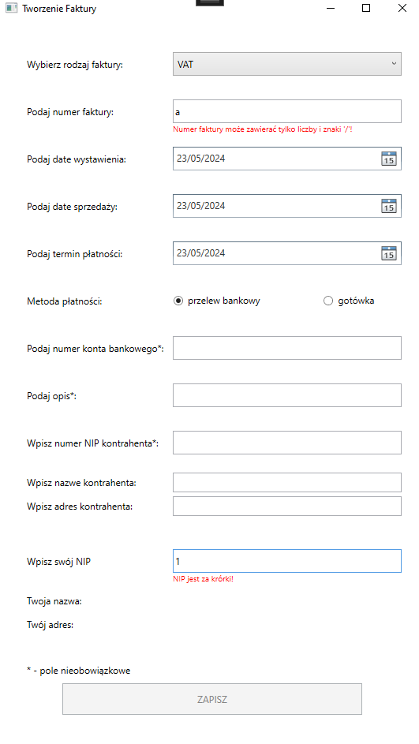
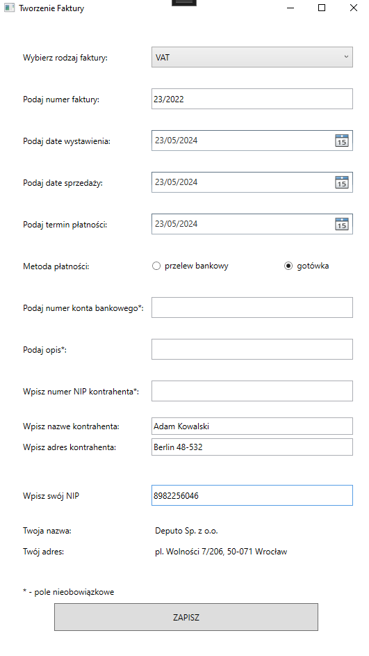

# Rejestr Faktur

Schemat bazy danych:

# Funkcjonalności

- wyszukiwanie danych firmy przez NIP
- generator faktur .pdf z danych
- zapisywanie gotowych faktur na dysku
- tworzenie faktur
- przeglądanie gotowych faktur
- edycja gotowych faktur
- usuwanie faktur

# Rozwiązania techniczne

- convertery użyte w xamlu (IValueConverter)
- validacja przez ValidationRules
- architektura MVVM
- repository/service pattern
- asynchroniczność
- dodawanie, edycja i usuwanie danych z bazy danych przy użyciu orm

# Wizualizajca aplikacji

Przykładowa wygenerowana faktura ścieżka: RejestrFaktur/Invoices/1.05.2024.pdf

# Testy jednostkowe

Testy jednostkowe zostały wykonane do plików validujących okna formularzy

# Użyte biblioteki

- HtmlAgilityPack
- Entity Framework Core
- QuestPdf
- XUnit

# Jak uruchomić?

# 1.

A. Trzeba wykonać clone repozytoria

B. Trzeba zmianić connection stringa i ścieżke w pliku konfiguracyjnym (w pliku App.config)

C. Trzeba wykonać w Package Manager Control komende update-database

# 2

A. Trzeba wykonać clone repozytoria

B. Trzeba zrobić import bazy danych (plik invoiceDbCopy.bacpac)

C. Trzeba zmianić connection ścieżki w pliku konfiguracyjnym (w pliku App.config)

# Creditsy

Strona do wyszukiwania danych po NIPie:
https://aleo.com/

Strona do wygenerowania schematu bazy danych:
https://dbdiagram.io/

Strona z algorytmem zamiany liczby na słowa:
http://dev.cdur.pl/Artykuly/Zamiana-kwoty-liczbowej-na-kwote-slowna-w-CSNET